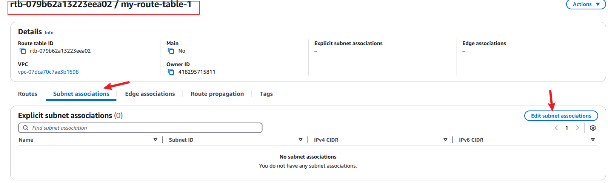

# AWS-VPC
setting up and configuring VPC infrastructures, including gateways, routing table on the AWS VPC and establishing connection between VPC through VPC peering.

# Create new repository named AWS-VPC as shown in the diagram below:

afterwhich i cloned it into my local repository 

i switched to the vscode studio and added an image folder where i stored screenshots for documentation.

## CREATE VPC
I created a VPC "my vpc 01" using ipv4 CIDR manual output "10.0.0.0/16" as shown below:

## Configuring Subnets within the VPC
I  navigated to the subnet option and created a public and private subnet, choosing the availability zone and providing the IPv4 CIDR as shown below:

my-public-subnet-1

my-private-subnet-1

* i repeated the same steps in setting up both hth eprivate and public subnet the only difference was the IPv4 subnet CIDR block.

## Creating an internet Gateway and attaching it to the VPC

Navigating to the "Internet Gateway" option and creating an internet gateway names "my-internet-gw-1" afterwhich i attached it to the VPC as show below:

## Enabling internet connectivity with the Internet Gateway by setting up Routing tables.
Proceeeding to the route table option on the AWS management console i create a new route table "my-route-table-1" attaching the VPC to it 

afterwhich i went under the subnet association option in the newly created route table and assoiciated it with "my-public-subnet-1"

after a succesful association i added a new route destination "0.0.0.0/0" for the internet gateway (my-internet-gw-1) that was just created:

the route table has been configured to route traffic to the internet Gateway which allows connectivity to the internet, only the subnet named "my-public=1" can access the internet because only it was associated with the route table.

## Enabling outbound internet access through NAT Gateway:
This is done by attaching the NAT Gateway to the subnet and attaching the route table
Navigating to the "NAT Gateway" section  and create a NAT "my-NAT-gw-1" this time i set the connectivity to private and attached the private subnet "my-private-subnet-1" to the NAT Gateway.

afterwhich i set the route destination of the private subnet by going to the "Route table" section added the destination "0.0.0.0/0 and target as NAT Gateway:

---
---
## VPC Peering
This is required to connect different parts of our cloud network (VPCs) to work smoothly where one one of the VPC is requesting and the other is accepting.

creating  two VPCs in the same region naming one requester VPC and the other accepter VPC , i set the resources as VPC only using the "IPv4 CIDR manual input" (192.168.0.0/16) as shown below:
* "Requester VPC"

Using the same process i create another VPC named as "accepter VPC" with a different IPv4 CIDR (172.16.0.0/16)
* "accepter VPC"

after having both the requester and accepter VPCs the next step is creating a peering connection navigating to the peering connection section and clicking on create i named the peering connection "my-1st-VPC-peering  and set the requester VPC as the local VPC as shown below:

From the diagram above we can see that the accepter VPC was peered during the configuration of the peer connection
 after the peering connection was requested i went further to accept the request as shown bellow:
 

 ## Setting the route for the accepter VPC
 selecting the accepter VPC and navigating to the "Route table" i click on routes section and copied and set the destination as the IPv4 CIDR of the "requester VPC"
 
 
 
 

 After completeting the steps above the same procedure was taken to set the IPv4 CIDR of the accepter VPC as the destination of the requester VPC and  "my-1st-VPC-peering was set as the target: 
 

 after this steps were concluded the routes were updated successfully showing their status as active as shown below:
 

 we can conclude that both VPCs were peered successfully.
